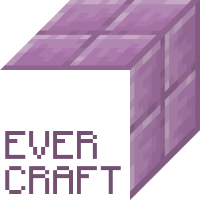

# EverCraft

Transform your gameplay to a real economy!

Pay other players with ÊVERs - the native currency of the Everscale blockchain.



## Features

* Secure SafeMultisig wallets for each player with no admin access to players' funds
* Personal key storage encrypted with player's password
* Player features:
  * Create and export private key with password protection
  * Generate and automatically deploy account
  * Get your deposit address and check your balance
  * Send by username or by Êver address
  

## Installation

### Compatibility

* [Minecraft v. 1.17.1 Java edition](https://minecraft.net)
* [PaperMC v. git-Paper-386](https://papermc.io/downloads#Paper-1.17)

### Basic

* Take the recent build of `EverCraft.jar` and put it in `Plugins` folder of your Paper installation
* Create the folder `EverCraft` in `plugins` folder
* Clone the `config.yml` file using the command below:
```shell
$> wget https://raw.githubusercontent.com/vp-mazekine/EverCraft/master/src/main/resources/config.yml?token=AOGQVVYHEIBQ3WLBGI5OH6TBWNWIY --no-check-certificate
```
* Configure the plugin as described in the [Configuration](#configuration) section below 
* Restart your server and enjoy

### Advanced

It is highly recommended setting up your own instance of [TON API](https://github.com/broxus/ton-wallet-api).
This ensures more security for your user funds and provides additional convenience for you if you have several Minecraft servers.

After having it installed, indicate its endpoints in the `config.yml` file.

## Configuration

`config.yml` file provides you with several configuration options, explained below.

### Everscale connectors

In order for the plugin to function, it needs to be properly connected to the Everscale network.

It uses TON API for easy wallet management and TON SDK for external transactions signing.

#### TON API parameters explained

| Key | Explanation |
| --- | --- |
| `api.endpoint` | The link to where the instance of TON API is located. It can include protocol, hostname and port, but cannot contain path elements and should not end with a slash|
| `api.prefix` | The repeated path element that will be added to all HTTP requests. Typically equals to `/ton/v3` |
| `api.key` | Access key, issued by TON API administrator (e.g., Broxus) |
| `api.secret` | Secret phrase required for signing API calls, issued by TON API administrator | 

All parameters are required for plugin to function properly.

#### TON OS parameters explained

| Key | Explanation |
| --- | --- |
| `tonos.network` | Indicates which Everscale network to use. Typically equals to `main.ton.dev` |

### Security

EverCraft uses the two-level encryption of players data and, at the same time, provides the latter with an opportunity to input a password instead of private key each time.

To let it function securely, it needs the following two parameters initialized before using in-game.

You can use a random [UUID](https://uuidgenerator.net/) or any alphanumeric string of 64 bytes and longer. 

| Key | Explanation |
| --- | --- |
| `storage.password` | A secure phrase that will encrypt the players data container. |
| `security.salt` | A secure phrase required to generate a compliant private key. |

**⚠️ NB**

If you change these values in the `config.yml` after players have created their wallets, they will lose the access to their funds.

Please make a backup of configuration file after saving it.

### Localization

The following locales are supported (set one in `locale` configuration):

| Locale | Description |
| --- | --- |
| `en` | American English |

## Usage

TBD

## License 

TBD

## Credits

EverCraft uses several open-source masterpieces of Everscale ecosystem:
* [TON SDK](https://github.com/tonlabs/TON-SDK) by [TON Labs](https://tonlabs.io) (with a Kotlin wrapper by [@mdorofeev](https://github.com/mdorofeev))
* [TON API](https://github.com/broxus/ton-wallet-api) by [Broxus](https://broxus.com)
